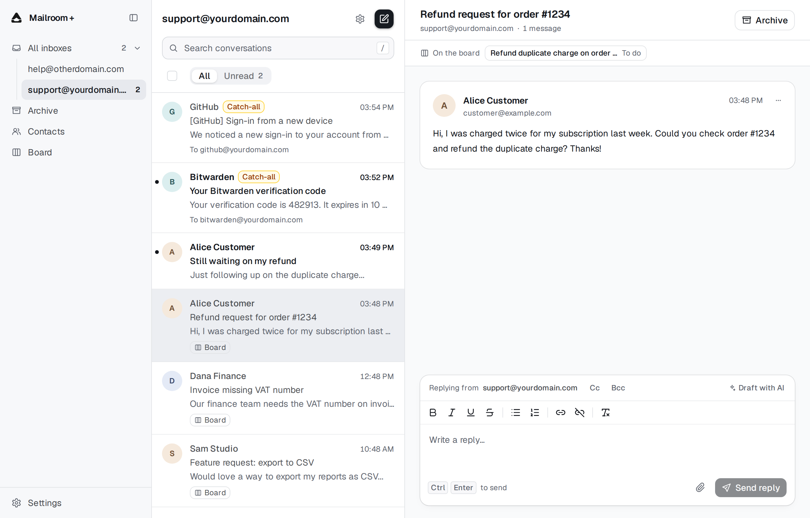

# Mailroom +

**A self-hosted shared inbox for humans and AI agents, running entirely on Cloudflare.**

Mailroom + is a fork of the original Mailroom with a large set of features added
for everyday use. It runs in your own Cloudflare account on Workers, Email
Routing, D1, R2 and Web Push.

## Features

### Mail

- **Unified inbox.** Manage multiple addresses and domains in one workspace.
- **Compose and reply.** Send new mail or reply to conversations, with attachments.
- **Search and triage.** Search message content, filter conversations, mark read
  or archive in bulk, and restore or permanently delete archived conversations.
- **Contacts.** Keep names, companies, phone numbers and notes, see each
  contact's conversations, and autocomplete them in To, Cc and Bcc. Import from
  CSV or vCard.

### Automation

- **AI reply drafts.** Per-inbox drafting with custom instructions and
  playbooks. You review and approve before anything is sent.
- **Automatic labels.** Organize incoming mail with natural-language rules.
- **Rules.** Build IF / AND / OR conditions on sender, recipients, subject, body
  and attachments, then label, mark read, archive, skip drafts or
  notifications, or forward.
- **Spam blocking.** Block a sender by address or whole domain, on one inbox or
  all of them. Blocked mail is rejected before it reaches Mailroom.

### Integrations

- **MCP server.** Let external AI agents read conversations, compose email and
  send replies through scoped OAuth access.
- **Notifications.** Opt in to browser push alerts, or a notice email to one
  address.
- **Private by default.** Everything runs in your own account, with Cloudflare
  Access protecting the web app.

## Deploy

Click **Deploy to Cloudflare** above. Storage, queues and database migrations
are provisioned for you, and the app's setup screen walks you through turning
on Cloudflare Access and connecting your email domain.

You will need:

- A domain on Cloudflare
- R2 enabled
- The Workers Paid plan (for outbound email)

Prefer to set things up by hand, or deploying from an existing fork? See the
[manual deployment guide](docs/deployment.md).

## MCP server

The MCP server ships in the same Worker at `https://<your-hostname>/mcp`, and
its URL is shown in **Settings > AI**. It is its own OAuth 2.1 authorization
server with `inbox.read` and `inbox.send` scopes.

| Tool | Scope |
| --- | --- |
| `list_inboxes` | `inbox.read` |
| `search_conversations` | `inbox.read` |
| `get_conversation` | `inbox.read` |
| `reply_to_conversation` | `inbox.send` |
| `send_email` | `inbox.send` |

Send tools only use inboxes already registered in Mailroom, require an
idempotency key, and are capped by `MCP_DAILY_SEND_LIMIT`. Set
`MCP_SEND_ENABLED=false` to turn them off for every client. Setup details are in
[connect an AI agent over MCP](docs/deployment.md#optional-connect-an-ai-agent-over-mcp).

## Roadmap

- [x] Per-inbox auto labels on new inbound mail
- [x] Full-text search in the conversation list
- [ ] External tools for the draft agent (for example Stripe or product databases)
- [ ] Delivery and bounce status inside the conversation

## License

[Apache-2.0](LICENSE)
